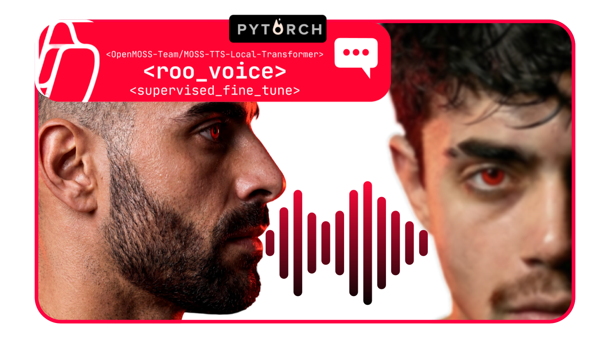

<p align="center"></p>

# Roo Voice

A local text-to-speech app for **Roo's voice** — that signature baritone with the estuary accent.
Clone this repo, run one command, and a polished web UI opens in your browser. Type text, hear Roo.

<p align="center">
  
  &nbsp;&nbsp;
  &nbsp;&nbsp;
  &nbsp;&nbsp;
</p>

<p align="center"><em>Runs on Apple Silicon (MLX), NVIDIA (CUDA), AMD (Vulkan/ROCm), and NPUs (ONNX).</em></p>

The voice is a **reference-conditioned, single-voice** model: the fine-tune puts Roo's timbre and
accent in the weights, and a bundled `reference.wav` completes the delivery. Everything — the
reference and the decoding settings — is **baked in**, so you don't configure anything.

---

## Quick start (one command)

```bash
git clone https://github.com/<you>/roo-voice-tts-app.git
cd roo-voice-tts-app
```

**macOS (Apple Silicon) or Linux (NVIDIA GPU):**
```bash
./start.sh
```

**Windows (NVIDIA GPU):**
```bat
start.bat
```

That's it. The launcher detects your hardware, installs what it needs into a local `.venv`, downloads
the right model from Hugging Face on first run, and opens **http://localhost:8080/**.

> First run downloads the model (3–6 GB) and installs dependencies — give it a few minutes. After
> that it starts in seconds.

---

## Which model runs on my hardware?

<p align="left">
  
  &nbsp;&nbsp;
  &nbsp;&nbsp;
  &nbsp;&nbsp;
</p>

The voice ships in several builds so it runs well on **any** silicon. The launcher auto-picks for
Apple Silicon and NVIDIA; AMD and NPU users pick a build below. All builds are the *same* fine-tuned
voice — they differ only in quantization and runtime.

| Your hardware | Recommended build | Size | Memory | Runtime | Auto? |
|---|---|---|---|---|---|
| **Apple Silicon** (M1–M4) | [`…_mlx4`](https://huggingface.co/abliter8-ai/Roo-Voice_MOSS_TTS_LT_mlx4) — MLX 4-bit *(default)* | 2.3 GB | ~4 GB unified | `mlx-audio` | ✅ verified |
| Apple Silicon, more headroom | [`…_mlx8`](https://huggingface.co/abliter8-ai/Roo-Voice_MOSS_TTS_LT_mlx8) — MLX 8-bit | 3.6 GB | ~5 GB unified | `mlx-audio` | opt-in |
| **NVIDIA GPU** (Turing+/RTX 20-series+) | [`…_int4`](https://huggingface.co/abliter8-ai/Roo-Voice_MOSS_TTS_LT_int4) — NF4 4-bit *(default)* | 3.5 GB | ~4 GB VRAM | `transformers` + `bitsandbytes` | ✅ verified |
| NVIDIA, more headroom | [`…_int8`](https://huggingface.co/abliter8-ai/Roo-Voice_MOSS_TTS_LT_int8) / [`…_bf16`](https://huggingface.co/abliter8-ai/Roo-Voice_MOSS_TTS_LT_bf16) | 4.5 / 6.1 GB | ~6 / ~10 GB VRAM | `transformers` | opt-in |
| **AMD Radeon** (RDNA3/3.5/4, iGPU or dGPU) | [`…_GGUF`](https://huggingface.co/abliter8-ai/Roo-Voice_MOSS_TTS_LT_GGUF) — Q4_K_M | 1.76 GB | Vulkan/ROCm | llama.cpp (Vulkan) | ⚠️ **unverified** |
| **Any GPU / CPU, one file** | [`…_GGUF`](https://huggingface.co/abliter8-ai/Roo-Voice_MOSS_TTS_LT_GGUF) — Q4_K_M | 1.76 GB | GPU or RAM | llama.cpp (Vulkan/ROCm/CUDA/Metal) | ⚠️ **unverified** |
| **NPU** (Ryzen AI XDNA2, Snapdragon Hexagon) | [`…_onnx`](https://huggingface.co/abliter8-ai/Roo-Voice_MOSS_TTS_LT_onnx) | — | — | onnxruntime (VitisAI/QNN EP) | ⚠️ **unverified** |

> **"verified" means we ran it and measured it** — Apple Silicon on an M1 Max and an M4 Air, NVIDIA on
> an RTX 5060 Ti. The rows marked **unverified** are architecturally sound but have not been run
> end-to-end by us; treat them as recipes, not promises.

**Picking by GPU vendor — the honest version:**

- **Apple Silicon → MLX.** MLX is Apple-only; the 4-bit is the same voice as the 8-bit, 1.3 GB lighter.
- **NVIDIA → int4/int8 (bitsandbytes) or GGUF.** `bitsandbytes` needs CUDA. Native **NVFP4** is a
  future Blackwell-only option.

  > ### ⚠️ Windows: `pip install torch` gives you a **CPU-only** PyTorch
  >
  > PyPI's Windows torch wheel is ~122 MB and contains **no CUDA**. The real CUDA build is ~2.5 GB and
  > exists only on PyTorch's own index. Install it explicitly:
  >
  > ```
  > pip install torch torchaudio --index-url https://download.pytorch.org/whl/cu128
  > ```
  >
  > `start.bat` now does this for you and **verifies** it. This was the cause of the v1.0 Windows bug
  > where the app loaded, reported healthy, opened the UI, and never produced speech — it was silently
  > running on CPU. **v1.1.0 refuses to start rather than falling back to CPU.**
- **AMD Radeon → GGUF via llama.cpp (Vulkan).** `bitsandbytes` is NVIDIA-first and unreliable on consumer
  Radeon, so **don't** use the int4/int8 builds on AMD — use the GGUF with llama.cpp's **Vulkan** backend
  (works on RDNA iGPUs like the 890M and dGPUs; ROCm is an option on supported cards). This is also the
  single cross-vendor file that runs everywhere.
- **NPU (Ryzen AI / Snapdragon) → ONNX.** onnxruntime runs the ONNX build on the NPU via VitisAI (AMD
  XDNA2) or QNN/Hexagon (Snapdragon). Great for low-power; needs the platform's onnxruntime EP.
- **CPU** works via the GGUF but is slow — fine for the occasional clip, not interactive use.

> **Shared dependency:** every build needs the ~7 GB **MOSS-Audio-Tokenizer** codec (fetched once from
> [OpenMOSS](https://huggingface.co/OpenMOSS-Team/MOSS-Audio-Tokenizer), or the
> [ONNX codec](https://huggingface.co/OpenMOSS-Team/MOSS-Audio-Tokenizer-ONNX) for the GGUF/ONNX paths).
> The LM quant is what shrinks (down to 1.76 GB); the codec size is inherent to MOSS-TTS Local.

---

## Using the voice well

- **Keep it short.** Best fidelity is a **sentence or two (~15 seconds)**. The model can technically
  run longer, but quality drifts on long passages — it's a short-clip single-voice model.
- **Punctuation shapes the pauses.** Use commas, full stops and question marks for pacing and prosody.
- **No SSML / markup.** MOSS's text normalizer ignores HTML/SSML/semantic tags — type plain text.
- **Fixed voice.** The reference is served internally; you can't (and don't need to) supply one.

Decoding is locked to the accepted contract: seed 42, temperature 1.0, top-k 50, top-p 0.95,
repetition penalty 1.1, 32 RVQ codebooks, 24 kHz mono.

---

## How fast is it? (time-to-speech)

Generation is autoregressive, so wall-clock time scales with the **length of the audio** produced —
and it is **slower than real-time on every machine**. Plan for the wait; this is not a streaming voice.

**These are measured, on the named hardware, not estimates** (2026-07-17, v1.1.0, one-sentence clip
≈ 4.4 s of audio):

| Hardware | Per-sentence | Real-time factor |
|---|---|---|
| **Mac Studio** (M1 Max, 32-core GPU) | **~10–11 s** | ~2.6× |
| **MacBook Air** (M4, 10-core GPU, 16 GB) | **~55 s** | ~12× |
| **NVIDIA RTX 5060 Ti** (INT4 NF4) | **~15 s** | ~3.5× |
| Bigger NVIDIA cards (4090 / A100 …) | less | proportionally quicker |

Your Mac's GPU core count matters far more than its generation: an M4 Air is ~4× slower than an
M1 Max here, because it has ~⅓ the GPU cores. **If you're on a Air-class machine, ~55 s per sentence
is normal and expected — it is not broken.**

### The first run is slow, once

On first launch the app **warms up** before the UI opens: it compiles GPU kernels for your machine,
which takes **~4–5 minutes on a MacBook Air** and **under a minute on a Mac Studio**. The launcher
shows this with a progress bar and tells you what it's doing.

This is deliberate. That cost is unavoidable the first time — but it's paid *before* you click Speak,
not on your first sentence. (In v1.0 it was not: the first generation on an M4 Air took **6 minutes
40 seconds**, which is why the app looked frozen. See `docs/` IP-176.) The compiled kernels are cached,
so later launches warm up in ~10–15 s.

---

## Longer audio — compose

Because the voice is happiest on short lines, the way to make **longer** audio is to generate several
short lines and stitch them together. There are two ways:

**In the web UI (no extra tools).** Put one sentence per line in the box and click **Compose**. The app
generates each line in turn (showing progress), stitches them into a single clip **in your browser**, and
gives you a **Download WAV** button. Nothing to install.

**From the command line** — `tools/compose.py`, for scripting / larger jobs:

```bash
# one line per line of a text file
python tools/compose.py --infile script.txt --out story.wav

# or inline, with a custom pause between lines
python tools/compose.py --text "After the last dance class..." "Could you ask Sarah..." --out out.wav --gap 0.5
```

> The **command-line** tool uses **ffmpeg** to stitch — see *System dependencies* below. The **web-UI**
> Compose does **not** need ffmpeg (the browser does the stitching).

---

## System dependencies

The Python deps install automatically (`start.sh` / `start.bat`). One optional **system** tool:

| Tool | Needed for | Install |
|---|---|---|
| **ffmpeg** | the command-line `tools/compose.py` only (not the app or web UI) | macOS `brew install ffmpeg` · Debian/Ubuntu `sudo apt install ffmpeg` · Windows `winget install ffmpeg` or [download](https://ffmpeg.org/download.html) |

If ffmpeg is missing, `compose.py` prints a clear message telling you to install it; the app and the
web-UI Compose keep working without it.

---

## What's in this repo

```
roo-voice-tts-app/
├── AGENTS.md / CLAUDE.md / GEMINI.md   setup guides for coding agents (Codex, Claude Code, Gemini CLI)
├── start.sh / start.bat      one-command launchers (auto-detect hardware)
├── reference.wav             the identity reference (required, baked into the server)
├── web/index.html            the Roo Voice web UI
├── server/roo_serve.py       serving backend (MLX + transformers), OpenAI-compatible /v1/audio/speech
├── server/requirements-*.txt dependencies per runtime
├── tools/compose.py          batch-generate short lines + ffmpeg them into longer audio
├── recipes/                  manual step-by-step recipes + hardware detail
└── assets/                   fonts, backgrounds, animations, sample audio
```

Manual setup (if you'd rather not use the launcher): see
[`recipes/mlx-apple-silicon.md`](recipes/mlx-apple-silicon.md) and
[`recipes/nvidia-cuda.md`](recipes/nvidia-cuda.md).

---

## API

The server also exposes an OpenAI-style endpoint:

```bash
curl -X POST http://localhost:8080/v1/audio/speech \
  -H 'Content-Type: application/json' \
  -d '{"input":"After the last dance class, I parked the car beside the garden wall."}' \
  --output roo.wav
```

---

## Something wrong? Send a report

Don't describe the symptom — **send the file**. Roo Voice writes a diagnostics report with everything
needed to diagnose it (hardware, runtime, model, versions, timings, and the actual error):

- **In the launcher window:** click **Save report** (it appears automatically if anything fails).
- **Or, while it's running:** open <http://localhost:8080/diagnostics>
- **Or grab the logs directly:**
  - macOS: `~/Library/Application Support/Roo Voice/logs/`
  - Windows: `%LOCALAPPDATA%\Roo Voice\logs\`

The report lands on your **Desktop** as `roo-voice-report.txt`. Your home directory is redacted to `~`
and anything token-shaped is stripped, so it's safe to paste or attach.

Two things worth checking before reporting:

| Symptom | Likely cause |
|---|---|
| "It's stuck on the first run" | It's warming up — **~4–5 min on a MacBook Air**, once. The progress bar is telling the truth. |
| "A sentence takes ~55 s" | Normal on an Air-class Mac. See the speed table above. |

---

## License & provenance

The models are quantized/exported forms of a single-speaker supervised fine-tune of
[MOSS-TTS-Local-Transformer](https://huggingface.co/OpenMOSS-Team/MOSS-TTS-Local-Transformer) with the
[MOSS-Audio-Tokenizer](https://huggingface.co/OpenMOSS-Team/MOSS-Audio-Tokenizer) codec (both
Apache-2.0, OpenMOSS). Weights derived from them are redistributed under the same license.
