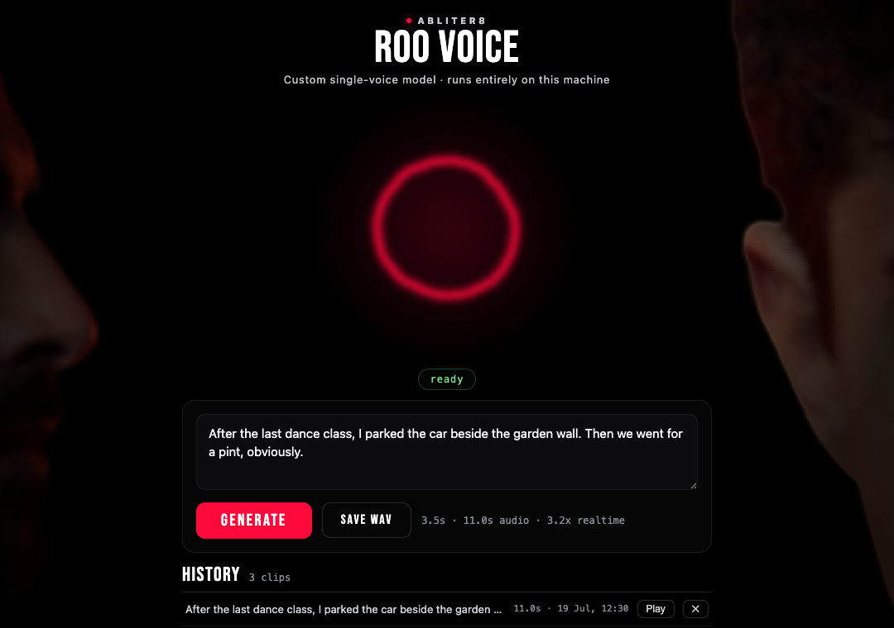

<p align="center"></p>

# Roo Voice

A desktop text-to-speech app for **one voice — Roo's**: that signature baritone with the estuary
accent, baked straight into the model weights. Download, type, hear Roo. Everything runs on your
machine: no account, no cloud, no telemetry, no configuration.

**v2.0.0** is a single native app for **macOS, Windows, and Linux** — the model downloads itself on
first launch, generation is deterministic (same text → same audio, every time), and the app keeps
itself updated.

---

## Download

| Platform | File | Notes |
|---|---|---|
| **macOS** (Apple Silicon, macOS 14+) | `Roo Voice_x.x.x_aarch64.dmg` | Signed & notarized. Runs on Metal |
| **Windows 10/11** (x64) | `Roo Voice_x.x.x_x64-setup.exe` | GPU via Vulkan (NVIDIA / AMD / Intel), CPU fallback |
| **Linux** (x64, Ubuntu 22.04+ / glibc 2.35+) | `.AppImage` (self-updating) or `.deb` | GPU via Vulkan, CPU fallback |

⬇️ **[Latest release](https://github.com/abliter8-ai/roo-voice-tts/releases/latest)**

First launch downloads the voice model (**~740 MB**, with a real progress bar; resumes if
interrupted; checksum-verified). After that, launches take seconds.

## What you get

- **Generate** — type up to a few paragraphs; long text is split into sentences and joined
  automatically into one clip.
- **History** — every clip is kept locally; replay, save, or delete. Survives restarts.
- **Compose** — merge clips into one longer WAV: reorder, set the gap after each clip, optional
  crossfade, export.
- **Live visualizer** — an audio-reactive energy field, driven by the actual playback.
- **Self-updating** — the app checks GitHub Releases and updates itself when you approve.

## Speed — measured, not promised

Generation speed vs. audio length ("3× realtime" = a 6-second clip takes ~2 seconds):

| Hardware | Path | Speed |
|---|---|---|
| Apple M1 Max | Metal | **~3.3× realtime** |
| NVIDIA RTX 5060 Ti (Linux) | Vulkan | **~5× realtime** |
| Modern desktop x86 CPU (no GPU at all) | CPU | **~1× realtime** |
| Snapdragon X (native ARM64 measurement) | CPU | **~2.9× realtime** |

## The absolute minimum (a.k.a. the worst hardware that works)

No GPU required. The model is small enough (553 M parameters, 4-bit) that a CPU can carry it:

- **CPU:** any x86-64 with **AVX2** — that's roughly **2013 (Intel Haswell / AMD Excavator) or
  newer**. A ten-year-old office laptop qualifies.
- **RAM:** ~2 GB free while generating (a 4 GB machine is a workable floor).
- **Disk:** ~1 GB (app ≈ 200 MB + models ≈ 740 MB).
- **What that feels like:** on a modern CPU, about realtime. On decade-old silicon expect a clip to
  take ~2–4× its duration — a 10-second line lands in 20–40 seconds. Slow, but it works, and the
  output is *identical* to what a GPU produces (deterministic decoding).

Not supported: Intel Macs, 32-bit anything, pre-AVX2 CPUs, and **Windows-on-ARM running the x64
build under emulation** — emulation subtly breaks the numerics and you get silence instead of
speech. (A native Windows ARM64 build is on the roadmap; already measured at ~2.9× realtime on a
Snapdragon X laptop.)

## How it works

```
your text ─→ phonemes (espeak-ng, en-GB) ─→ speech codes (0.5B LLM, llama.cpp, greedy)
          ─→ waveform (NeuCodec int8 ONNX decoder, always CPU) ─→ 24 kHz WAV
```

The voice model is a single-voice identity-locked fine-tune of
[NeuTTS-Air](https://huggingface.co/neuphonic/neutts-air) — the fine-tune *is* the voice; there is
no voice cloning, no reference audio, and no way to make it sound like anyone else. Weights:
[abliter8-ai/Roo-Voice-NeuTTS-GGUF](https://huggingface.co/abliter8-ai/Roo-Voice-NeuTTS-GGUF).

Everything is served from a local engine on a loopback port the app manages for you. The only
network traffic is the one-time model download (Hugging Face), the update check (GitHub), and
nothing else — your text and audio never leave the machine.

## Troubleshooting

- The status pill under the visualizer tells the truth: `downloading` (with honest byte counts) →
  `loading` → `warming` → `ready`. First launch spends a while in `downloading`; that's the 740 MB.
- `warming` exists so your **first generation is fast** — the app pre-compiles the GPU pipelines at
  startup instead of during your first request.
- If the pill says `failed`, the message beside it is the actual reason. File it in
  [Issues](https://github.com/abliter8-ai/roo-voice-tts/issues) together with your OS and hardware.

## Building from source

```bash
# engine (frozen sidecar): phonemizer + onnxruntime + llama-server
app/engine/freeze/build-macos.sh        # or build-linux.sh / build-windows.ps1
# app shell + UI
cd app && npm ci && npm run tauri build
```

CI builds all three platforms from `.github/workflows/build-v2.yml`; releases are cut from tags.

## Component licenses

The voice model is Apache-2.0 (as is its base, NeuTTS-Air). Bundled components:
[llama.cpp](https://github.com/ggml-org/llama.cpp) (MIT),
[NeuCodec](https://huggingface.co/neuphonic/neucodec) (Apache-2.0),
[espeak-ng](https://github.com/espeak-ng/espeak-ng) + phonemizer (**GPL-3.0**), onnxruntime (MIT),
Tauri (MIT/Apache-2.0).

---

<sub>Looking for the v1.x app (MOSS-TTS, Python launcher)? It still exists —
[v1.1.1](https://github.com/abliter8-ai/roo-voice-tts/releases/tag/v1.1.1) — but v2 replaces it:
one app instead of installer+browser, a 740 MB model instead of 9.6 GB, and roughly 10× faster
generation.</sub>
